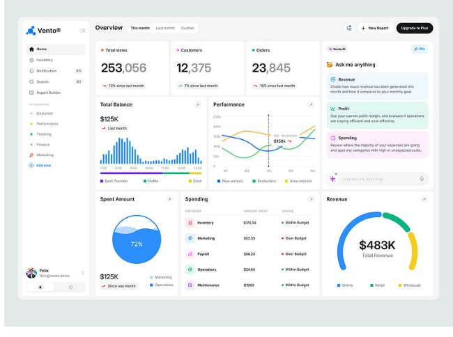

# UX Information Architecture - Direnix

Status: Draft v0.1  
Data: 2026-06-20  
Publico: UX, Produto, Arquitetura, Frontend, QA

## 1. Direcao visual

A experiencia deve parecer um portal operacional moderno para engenheiros, seguranca e gestao. A referencia visual salva em `docs/assets/ux-reference-human-ops-dashboard.png` deve ser usada como inspiracao de densidade, calma visual, hierarquia e composicao, mas nao deve ser copiada literalmente.

O produto deve se aproximar mais de um portal tipo Azure Portal do que de um dashboard generico de IA:

- Humano, claro e operacional.
- Denso sem ficar pesado.
- Tecnico sem parecer ferramenta antiga.
- Gerencial sem parecer landing page.
- Visualmente calmo, com cores funcionais.
- Focado em decisao e proximo passo.
- Mais chamativo que a demo atual, com hierarquia visual forte, micrograficos, icones funcionais e acoes claras.
- Operacional por padrao: a primeira pergunta da tela deve ser "o que precisa ser feito agora?".



## 2. Principios de UX

### 2.1 Trabalho antes de espetaculo

O usuario abre o produto para entender risco, limpar AD, priorizar remediacao e justificar decisao. A interface deve reduzir ansiedade operacional, nao tentar impressionar com elementos decorativos.

### 2.2 Portal, nao vitrine

A primeira tela deve ser o cockpit do ambiente. Evitar hero section, frases de marketing, gradientes chamativos, mockups decorativos ou cards gigantes que nao ajudam o trabalho.

### 2.3 Azure-like, mas com identidade propria

Usar como referencia:

- Sidebar persistente.
- Topbar utilitaria.
- Conteudo em blades/paineis.
- Filtros claros.
- Cards pequenos de KPI.
- Tabelas densas.
- Drill-down contextual.
- Breadcrumb e escopo sempre visiveis.

Nao copiar nomenclatura, icones, layout ou marca da Microsoft.

### 2.4 Explicar com dado, nao com texto longo

O produto deve comunicar por indicadores, labels, tooltips, estados e contexto. Evitar blocos explicativos longos dentro do dashboard.

### 2.5 Decisao visivel

Todo achado deve deixar claro:

- O que esta errado.
- Qual regra detectou.
- Qual benchmark sustenta.
- Qual o impacto.
- O que fazer.
- Se e para limpar, ajustar, implementar, investigar, monitorar, descomissionar ou aceitar risco.
- Qual e o proximo passo clicavel: exportar, gerar script, abrir runbook, pedir evidencia, aceitar risco ou validar.
- Qual e o nivel de confianca da recomendacao.

### 2.6 Operacao antes de acusacao

A experiencia nao deve parecer um "dedo-duro" de problemas. O usuario deve sentir que a ferramenta esta ajudando a resolver:

- Priorizar fila.
- Entender dependencia.
- Confirmar owner.
- Exportar recorte para revisao.
- Gerar script revisavel.
- Validar antes/depois.
- Registrar aceite quando o negocio escolhe manter o risco.

## 3. Personas e modos de leitura

### 3.1 Engenheiro de AD

Objetivo:

- Configurar coleta.
- Validar escopo.
- Investigar evidencia.
- Gerar plano de remediacao.

Precisa ver:

- Objeto afetado.
- Caminho tecnico.
- Evidencia.
- Threshold.
- Comando sugerido ou WhatIf.
- Dependencias e rollback.

### 3.2 Seguranca

Objetivo:

- Priorizar risco.
- Validar exposicao Tier 0.
- Acompanhar hardening.
- Revisar aceite de risco.

Precisa ver:

- Severidade.
- Business risk score.
- DCSync, delegation, AdminSDHolder, LDAP, NTLM, contas privilegiadas.
- Benchmark.
- Owner.
- SLA.

### 3.3 Gestao

Objetivo:

- Entender exposicao.
- Cobrar progresso.
- Aprovar investimento.
- Aceitar ou recusar risco.

Precisa ver:

- Score geral.
- Tendencia.
- Top riscos.
- Backlog por decisao.
- Excecoes vencidas.
- Evolucao por area.
- Impacto em linguagem de negocio.

## 4. Arquitetura da informacao

### 4.1 Navegacao principal

Sidebar sugerida:

```text
Operations
Overview
Identity Risk
Privileged Access
Cleanup
Replication & DCs
Group Policy
Authentication
Service Accounts
Hybrid Identity
Governance
Evidence
Reports
Settings
```

### 4.2 Topbar

Elementos obrigatorios:

- Nome do ambiente ou dominio.
- Data/hora do ultimo run.
- Perfil de politica: MicrosoftDefault, CISStrict, OperationalBalanced ou Custom.
- Perfil de usuario logado.
- Status da coleta.
- Botao de novo assessment.
- Botao de exportar.
- Indicador de dados tecnicos ou gerenciais.

### 4.3 Overview

Primeira tela do dashboard.

Conteudo:

- Executive AD Health Score.
- Critical Identity Exposure Count.
- Cleanup Debt.
- Replication Risk.
- GPO Drift.
- Hybrid Identity Conflict.
- Top 5 riscos.
- Tendencia dos ultimos runs.
- Decisoes pendentes.
- Riscos aceitos vencendo.

### 4.3.1 Operations / Action Center

Tela principal para operacao tecnica.

Conteudo:

- Fila priorizada de acoes.
- Cards compactos: `Ready for cleanup`, `Needs evidence`, `Scripts generated`, `Risk expiring`.
- Tabela densa com ordenacao por risco, owner, idade, confianca e SLA.
- Botao de exportar CSV do recorte atual.
- Botao de gerar script revisavel quando permitido.
- Botao de abrir runbook externo quando a evidencia nao pode ser coletada.
- Filtro por acao: limpar, ajustar, implementar, investigar, aceitar risco.
- Filtro por confianca: alta, media, baixa.
- Filtro por protecao: hibrido, Tier 0, servidor, DC, GPO critica.

### 4.4 Pagina de dominio tecnico

Padrao para areas como Identity Risk, Cleanup, GPO e Replication:

- Header compacto com score da area.
- Linha de KPIs.
- Filtros.
- Tabela principal.
- Painel lateral de detalhe.
- Timeline do finding.
- Evidencias relacionadas.

### 4.5 Evidence

Pagina de rastreabilidade:

- Lista de evidencias.
- Origem.
- Hash.
- Timestamp.
- Pacote de coleta.
- Regra relacionada.
- Classificacao de sensibilidade.

### 4.6 Governance

Pagina para controle:

- Owners ausentes.
- Excecoes abertas.
- Excecoes vencidas.
- Riscos aceitos por area.
- SLA.
- Itens sem decisao.

## 5. Layout

### 5.1 Shell

Estrutura recomendada:

- Sidebar fixa com largura entre 220 e 260 px.
- Topbar de 56 a 64 px.
- Conteudo com grid responsivo.
- Fundo neutro claro.
- Cards com borda sutil.
- Radius pequeno, entre 6 e 8 px.
- Sem sombras fortes.

### 5.2 Cards de KPI

Cards devem ser pequenos e comparaveis.

Cada card deve conter:

- Label curto.
- Valor principal.
- Delta ou tendencia.
- Status visual discreto.
- Tooltip com definicao.

Evitar:

- Cards gigantes.
- Texto explicativo longo.
- Icone decorativo sem funcao.
- Gradiente colorido como fundo principal.

### 5.3 Tabelas

Tabelas sao o centro da experiencia tecnica.

Colunas padrao para findings:

- Severity.
- Decision.
- Rule.
- Object.
- Domain.
- Business Unit.
- Owner.
- Age.
- SLA.
- Status.

Interacoes:

- Busca.
- Filtros.
- Ordenacao.
- Paginacao.
- Seletor de colunas.
- Agrupamento por categoria.
- Abrir detalhe em painel lateral.
- Exportar CSV/JSON do recorte atual.
- Indicador de total filtrado vs total geral.
- Persistencia local de ordenacao e colunas.

### 5.4 Painel lateral de detalhe

O detalhe deve abrir sem tirar o usuario do contexto.

Secoes:

- Resumo.
- Evidencia.
- Apoio a decisao.
- Confianca.
- Script ou runbook.
- Validacao antes/depois.
- Benchmark.
- Impacto tecnico.
- Impacto de negocio.
- Recomendacao.
- Aceite de risco.
- Historico.

## 6. Sistema visual

### 6.1 Paleta

Direcao:

- Fundo: cinza muito claro.
- Superficies: branco ou quase branco.
- Texto: cinza escuro.
- Bordas: cinza claro.
- Acento principal: azul operacional.
- Sucesso: verde.
- Alerta: amarelo.
- Alto risco: vermelho.
- Informativo: ciano ou azul claro.
- Para a proxima versao visual, usar acentos mais presentes em headers, badges, graficos e estados, mantendo fundo limpo.
- Usar cores por categoria de acao: cleanup, hardening, evidencia, risco aceito, script e validacao.

Evitar:

- Paleta roxa/azul neon dominante.
- Gradientes de IA generativa.
- Fundo escuro como padrao unico.
- Orbs, blobs, bokeh ou brilho decorativo.

### 6.2 Tipografia

Usar fonte de sistema:

```css
font-family: "Segoe UI", Arial, sans-serif;
```

Regras:

- Numeros de KPI podem ser grandes, mas nao heroicos.
- Tabelas devem priorizar legibilidade.
- Labels devem ser curtos.
- Sem letter spacing negativo.
- Sem escala de fonte baseada em viewport.

### 6.3 Iconografia

Usar icones funcionais:

- Filtro.
- Exportar.
- Atualizar.
- Evidencia.
- Risco.
- Owner.
- SLA.
- Settings.
- Script.
- Runbook.
- CSV/export.
- Evidence package.
- Validation.

Evitar icones decorativos repetidos em cada card.

## 7. Tom de interface

O texto deve ser direto, humano e operacional.

Exemplos bons:

- "3 riscos exigem decisao esta semana"
- "LDAP signing nao esta enforced"
- "Conta sensivel dormente ha 214 dias"
- "Aceite de risco vence em 12 dias"
- "Coleta parcial: repadmin nao disponivel neste host"
- "Falta evidencia cloud antes de limpar esta identidade"
- "AD Recycle Bin desabilitado: delete bloqueado no MVP"
- "Exportar 214 candidatos para revisao do owner"

Evitar:

- "Unlock powerful insights"
- "AI-powered posture revolution"
- "Transform your identity journey"
- "Discover hidden opportunities"

## 8. Estados obrigatorios

Toda tela deve tratar:

- Loading.
- Sem dados.
- Coleta parcial.
- Capacidade ausente.
- Erro de permissao.
- Evidencia sensivel ocultada.
- Filtro sem resultado.
- Run antigo.
- Comparacao indisponivel.

Estados de dado:

- `measured`: medido.
- `notMeasured`: nao medido.
- `notApplicable`: nao aplicavel.
- `capabilityMissing`: capacidade ausente.
- `redacted`: ocultado por sensibilidade.

## 9. Dashboard gerencial

### 9.1 Objetivo

Responder rapidamente:

- Estamos melhorando ou piorando?
- O que pode comprometer o negocio?
- O que precisa de decisao?
- Onde precisamos investir?
- Que risco esta aceito e ate quando?

### 9.2 Componentes

- Score geral.
- Score por area.
- Tendencia de risco.
- Top riscos.
- Backlog por decisao.
- Excecoes.
- SLA.
- Cobertura de evidencia.

### 9.3 Redacao gerencial

Detalhes sensiveis devem ser saneados:

- Nao exibir SID por padrao.
- Nao exibir DN completo por padrao.
- Nao exibir nome de conta privilegiada em card gerencial.
- Mostrar categoria, dominio, unidade, owner e impacto.

## 10. Dashboard tecnico

### 10.1 Objetivo

Permitir investigacao completa.

O usuario deve conseguir ir de um KPI para:

- Finding.
- Objeto.
- Regra.
- Evidencia.
- Benchmark.
- Recomendacao.
- Plano de remediacao.
- Export CSV.
- Script PowerShell revisavel.
- Runbook externo quando evidencia nao foi coletada.
- Validacao do proximo run.

### 10.2 Componentes

- Tabela de findings.
- Drill-down lateral.
- Grafico de tendencia.
- Filtros por categoria/severidade/owner/status.
- Evidencia vinculada.
- Exportacao.

## 11. Cliente de coleta

O cliente deve parecer uma ferramenta administrativa do Windows moderna:

- Wizard simples.
- Sidebar ou etapas numeradas.
- Preflight claro.
- Logs resumidos.
- Erros acionaveis.
- Caminho do output visivel.
- Gatilhos de coleta complementar para apoiar decisao.
- Opcao de importar CSV/JSON externo de SIEM ou Entra.

Etapas:

```text
1. Ambiente
2. Escopo
3. Tipos de objeto
4. Pacotes
5. Profundidade
6. Credencial
7. Preflight
8. Execucao
9. Resultado
```

Controles esperados:

- Tree picker para OUs.
- Checkboxes para tipos de objeto.
- Checkboxes para pacotes de feature.
- Segmented control para Quick, Standard e Deep.
- Badges de permissao necessaria.
- Resumo de impacto antes da coleta.
- Aviso claro quando um pacote tera cobertura parcial.

## 12. Login, perfis e acesso

O dashboard seguro deve abrir via servidor local autenticado. A tela de login deve ser simples, sem linguagem corporativa exagerada.

Perfis:

- LocalAdmin.
- CollectorOperator.
- SecurityAnalyst.
- RiskManager.
- Auditor.
- ExecutiveViewer.
- ReadOnlyTechnical.

Regras de UX:

- Mostrar o perfil logado no topo.
- Esconder acoes que o perfil nao pode executar.
- Para acesso negado, explicar em uma frase o que faltou.
- ExecutiveViewer deve ver apenas dados saneados.
- Auditor deve ver trilhas e evidencias permitidas, mas nao alterar estado.
- RiskManager deve ter fluxo claro para aceitar risco com validade e justificativa.

## 13. Modo seguro vs export estatico

Modo seguro:

- Servido em `127.0.0.1`.
- Exige login.
- Aplica RBAC.
- Pode exibir dados tecnicos sensiveis conforme perfil.

Export estatico:

- Usado para gestao ou auditoria.
- Nao deve conter dados sensiveis por padrao.
- Nao deve prometer controle de acesso.
- Deve indicar data, run, perfil de saneamento e fonte.

## 14. Anti-padroes

Nao usar:

- Landing page como primeira tela.
- Hero grande.
- Frases de marketing.
- Cards dentro de cards.
- Gradientes roxo/azul dominantes.
- Elementos decorativos sem funcao.
- Layout que so fica bonito com dados perfeitos.
- Grafico sem pergunta de negocio.
- Score sem explicar regra/threshold.
- Alertas que nao indicam proximo passo.
- HTML estatico com dados sensiveis fingindo ter autenticacao segura.
- Perfis que apenas escondem botoes no frontend sem autorizacao no servidor local.

## 15. Requisitos para QA de UX

QA deve validar:

- Dashboard abre sem internet.
- Dashboard seguro exige login.
- Perfis diferentes veem conteudo diferente.
- Export estatico gerencial nao contem dados sensiveis.
- Texto cabe em 1366x768 e 1920x1080.
- Sidebar nao oculta conteudo.
- KPIs continuam legiveis com valores longos.
- Tabelas suportam 10.000 findings.
- Estado `capabilityMissing` nao parece sucesso.
- Dados sensiveis ficam ocultos na visao gerencial.
- Todo finding mostra decisao recomendada.
- Toda decisao mostra proximo passo.
- Paleta nao parece dashboard generico de IA.

## 16. Entregaveis UX esperados

Antes de implementar frontend:

- Wireframe de login.
- Wireframe do shell.
- Wireframe da Overview.
- Wireframe de uma pagina tecnica.
- Wireframe de painel lateral de finding.
- Wireframe da pagina Governance.
- Wireframe do seletor de coleta.
- Wireframe do fluxo de aceite de risco.
- Guia visual com tokens.
- Lista de componentes.
- Estados vazios e erros.
- Fluxo do cliente de coleta.

## 17. Decisoes abertas

| Tema | Opcoes | Recomendacao inicial |
| --- | --- | --- |
| Tema padrao | Claro, escuro, ambos | Ambos no MVP; claro como default |
| Navegacao | Sidebar fixa, tabs superiores | Sidebar fixa |
| Drill-down | Nova pagina, painel lateral | Painel lateral |
| Gerencial vs tecnico | Dashboards separados, toggle | Separados com dados saneados |
| Referencia visual | Imagem anexada, Azure Portal, Microsoft Defender | Usar como inspiracao, sem copia literal |
| Tela inicial | Overview, Operations | Operations para perfil tecnico; Overview para gestao |
| Visual | Demo atual, portal operacional refinado | Redesenhar para portal operacional mais marcante |
